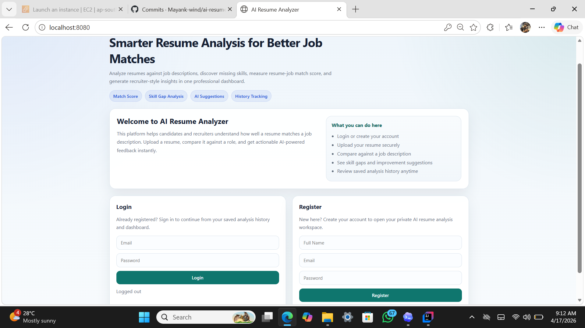
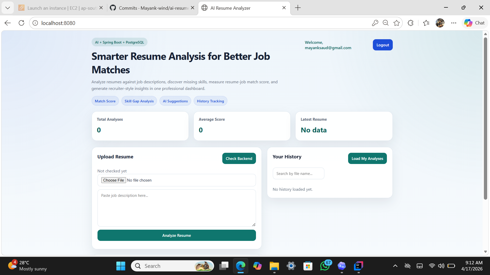
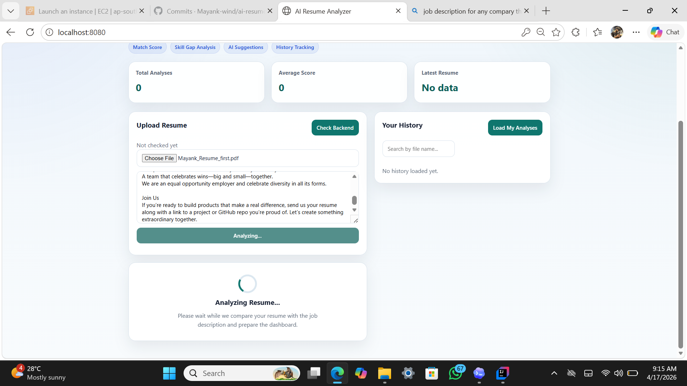
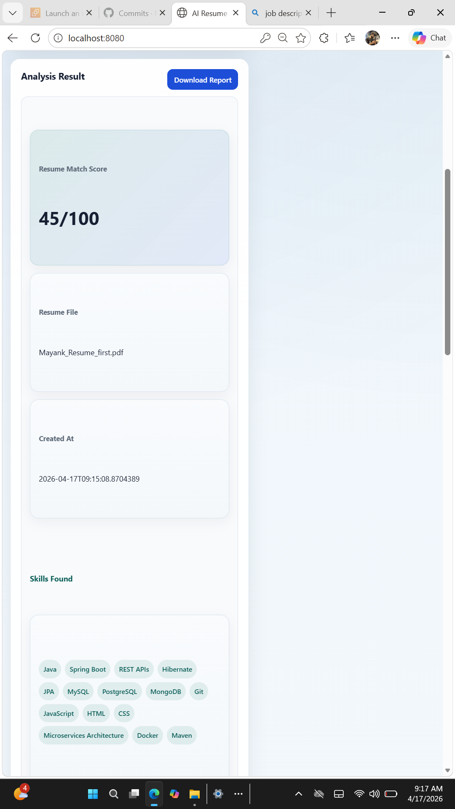
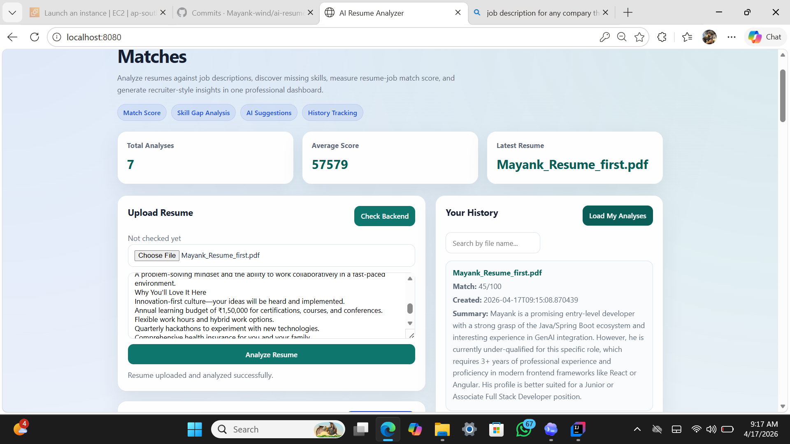

# AI Resume Analyzer


AI Resume Analyzer is a full-stack SaaS-style application that helps users evaluate resumes against job descriptions using AI. It extracts text from PDF resumes, compares the resume with a target role, generates a match score, identifies skills found and missing skills, suggests improvements, and stores user-specific analysis history in a secure dashboard.

## Live Demo
[Open Live Application](http://43.205.99.107:8081)

## Highlights
- JWT-based authentication with user-specific access
- Resume upload and PDF text extraction using Apache PDFBox
- Gemini-powered resume vs job description analysis
- Resume-job match score generation
- Skills found and missing skills analysis
- Suggestions and recruiter-style summary
- User-specific analysis history dashboard
- Downloadable analysis report
- PostgreSQL-ready backend with Docker Compose support
- Browser-based frontend built with HTML, CSS, and JavaScript
- Clean API error handling with custom exceptions
- Deployed on AWS EC2 using Docker

## Screenshots

### Landing Page


### Dashboard


### Analysis Loading State


### Analysis Result


### History Panel


## Features

### Authentication
- User registration
- User login
- JWT-based authorization
- Protected endpoints
- User-specific resume history isolation

### Resume Analysis
- Upload resume in PDF format
- Extract resume text using Apache PDFBox
- Paste a job description for comparison
- AI-powered resume-job analysis using Gemini
- Match score generation
- Skills found extraction
- Missing skills identification
- Suggestions and recruiter-style summary

### Dashboard
- Clean landing page and login/register experience
- Structured analysis dashboard
- Match score visualization
- Skills found and missing skills display
- User-specific history panel
- Search in analysis history
- Download analysis report

### Backend Quality
- Global exception handling
- Clean API error responses
- Custom exception classes
- Environment-based configuration
- PostgreSQL support
- Docker Compose setup for application and database

## Tech Stack

### Backend
- Java 25
- Spring Boot 4
- Spring Security
- Spring Data JPA
- Hibernate
- PostgreSQL
- H2 (fallback for local development)
- Maven

### AI Integration
- Gemini API

### Frontend
- HTML
- CSS
- JavaScript

### Tools and Libraries
- Apache PDFBox
- Lombok
- Docker
- Docker Compose
- AWS EC2

## Project Architecture

```text
src/
+-- main/
?   +-- java/com/ai/resume/
?   ?   +-- config
?   ?   +-- controller
?   ?   +-- dto
?   ?   +-- entity
?   ?   +-- exception
?   ?   +-- repository
?   ?   +-- security
?   ?   +-- service
?   +-- resources/
?       +-- static
?       +-- application.properties
```

### Layer Responsibilities
- Controller: handles HTTP requests and API endpoints
- Service: business logic, AI integration, and PDF extraction
- Repository: database access using JPA
- Entity: database table mapping
- DTO: request and response objects
- Security: JWT authentication and authorization
- Config: security and exception handling

## How It Works
1. User registers or logs in
2. User uploads a resume PDF
3. User pastes a job description
4. Backend extracts text from the resume
5. Gemini analyzes the resume against the job description
6. The application returns:
    - match score
    - skills found
    - missing skills
    - suggestions
    - summary
7. The result is stored in the database
8. The user can review analysis history anytime in the dashboard

## API Endpoints

### Auth
- `POST /api/auth/register`
- `POST /api/auth/login`

### Resume Analysis
- `POST /api/resumes/upload`
- `GET /api/resumes`
- `GET /api/resumes/{id}`

### Utility
- `GET /api/health`
- `GET /api/user/me`

## Setup Instructions

### 1. Clone the repository
```bash
git clone <your-repo-url>
cd ai-resume-analyzer
```

### 2. Configure environment variables
Use the sample values from `.env.example`.

Required variables:
- `DB_URL`
- `DB_DRIVER`
- `DB_USERNAME`
- `DB_PASSWORD`
- `GEMINI_API_KEY`
- `JWT_SECRET`

### 3. Create the PostgreSQL database
```sql
CREATE DATABASE ai_resume_analyzer;
```

### 4. Run locally
Using PowerShell:

```powershell
$env:DB_URL="jdbc:postgresql://localhost:5432/ai_resume_analyzer"
$env:DB_DRIVER="org.postgresql.Driver"
$env:DB_USERNAME="postgres"
$env:DB_PASSWORD="your_postgres_password"
$env:GEMINI_API_KEY="your_gemini_api_key"
$env:JWT_SECRET="your_base64_jwt_secret"
.\mvnw spring-boot:run
```

### 5. Open the application
```text
http://localhost:8080/index.html
```

## Docker Support
This project includes:
- `Dockerfile`
- `docker-compose.yml`

You can run the application and PostgreSQL together using Docker Compose.

## Deployment (AWS EC2 + Docker)
This application is deployed on AWS EC2 using Docker.

### Deployment Steps
1. Built a Docker image for the Spring Boot application
2. Configured environment variables such as `GEMINI_API_KEY` and `JWT_SECRET`
3. Deployed the Docker container on an EC2 instance
4. Configured AWS Security Groups for ports `8081`, `80`, and `443`
5. Exposed the application through the EC2 public IP

### Live Deployment
- Public URL: [http://43.205.99.107:8081](http://43.205.99.107:8081)

## Environment Template
This project includes `.env.example` to show the required environment variables without exposing secrets.

## Future Improvements
- Premium UI redesign with Tailwind
- Drag-and-drop resume upload
- Better skill-gap visualization
- Export report as PDF
- ATS-focused optimization suggestions
- Admin analytics dashboard
- More advanced deployment and monitoring

## Author
**Mayank Kumar Singh**  
GitHub: [Mayank-wind](https://github.com/Mayank-wind)

## Why This Project
This project demonstrates:
- full-stack application development
- secure JWT authentication
- AI integration with Gemini
- resume-job comparison workflow
- structured backend architecture
- production-style configuration using PostgreSQL, Docker, and environment variables
- deployment readiness on AWS